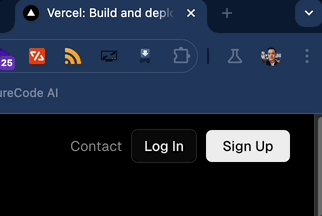

# PureCode.ai

- [PureCode.ai](#purecodeai)
- [Landing Page Thoughts](#landing-page-thoughts)
  - [General Comments](#general-comments)
    - [`<head>` element comments](#head-element-comments)
    - [`<body>` element comments](#body-element-comments)
      - [Unauthenticated User](#unauthenticated-user)
        - [Desktop (1280 viewport - MacBook Air MX) - top to bottom page comments](#desktop-1280-viewport---macbook-air-mx---top-to-bottom-page-comments)
          - [`<header>` element comments](#header-element-comments)
          - [Call-To-Action comments](#call-to-action-comments)
        - [Tablet (768px viewport - iPadMini)](#tablet-768px-viewport---ipadmini)
        - [Mobile (430px viewport - iPhone 15 Pro Max)](#mobile-430px-viewport---iphone-15-pro-max)
      - [Authenticated User](#authenticated-user)
        - [Desktop (1400px viewport - MacBookPro M1 Pro)](#desktop-1400px-viewport---macbookpro-m1-pro)
        - [Tablet (768px viewport - iPadMini)](#tablet-768px-viewport---ipadmini-1)
        - [Mobile (430px viewport - iPhone 15 Pro Max)](#mobile-430px-viewport---iphone-15-pro-max-1)
  - [General Positive Aspects of Landing Page (my bias - _strong opinions, weakly held_)](#general-positive-aspects-of-landing-page-my-bias---strong-opinions-weakly-held)
  - [Bugs/Possible Areas to Improve/General Critiques (my bias - _strong opinions, weakly held_)](#bugspossible-areas-to-improvegeneral-critiques-my-bias---strong-opinions-weakly-held)
- [Product Thoughts (web)](#product-thoughts-web)
- [VSCode Extension Thoughts](#vscode-extension-thoughts)

# Landing Page Thoughts

## General Comments

### `<head>` element comments

- `<link rel="preload" as="image" href="/img/project_table_section_dark.png">`
  - Suggest converting image to modern `.webp` format to align with other images on landing page and improve SEO score (included image conversion. see `images` directory; 20% size reduction vs `.png`, lossless conversion)

- `<meta name="description" content="A simple and powerful frontend AI copilot for the web.">`
  - Currently when I google "frontend ui component ai generator copilot" - the friendliest keywords I could mash together - `purecode.ai` shows up as the 28th link

- Suggest optimizing meta*description tag to include more keywords to move up SEO (e.g. \_A simple and powerful frontend UI component generator for the web powered by AI copilot.*)
- Related: Suggest including meta_keywords tag to include additional keywords. (e.g `<meta name="keywords" content="UI, component generator, AI copilot, frontend copilot">`)
- Suggest running site through [SEO optimizer](https://www.seoptimer.com/purecode.ai#recommendation)

- ``
  - Suggest offloading 3rd party analytics scripts off the main thread and on to service workers to increase [PageSpeed Score](https://pagespeed.web.dev/analysis/https-purecode-ai/sn6qlitvei?form_factor=desktop) (e.g. Hotjar) by implementing [Partytown package](https://partytown.builder.io/how-does-partytown-work)

- Run site through a  (might be a lot of noise and not worth the effort - just including it to be thorough)

### `<body>` element comments

#### Unauthenticated User

##### Desktop (1280 viewport - MacBook Air MX) - top to bottom page comments

###### `<header>` element comments

- NitPicky: `Sign In` button is slow to render wrt to `Sign Up` button. I've only used Clerk once in a side-project, but I don't recall this being an inherent issue with the library.

- NitPicky: `Sign In` font-sze is noticeably larger (1rem vs 0.875rem) than `Sign Up` font - minor point but I can't seem to justify the inconsistency as a prudent style choice (most likely overlooked - again ... nit-picky)
  - I fixed the inconsistency below by changing `Sign In` font-size to 0.875rem

- NitPicky and EasyFix: The `Sign In` and `Sign Up` buttons would benefit from hover styles to enhance UX (see `vercel.com` gif below)

###### Call-To-Action comments

##### Tablet (768px viewport - iPadMini)

- Thoughts not included for brevity (and given the use case for the site I suspect most users will be on a laptop) - would be willing to explore in further detail if requested

##### Mobile (430px viewport - iPhone 15 Pro Max)

- Thoughts not included for brevity (and given the use case for the site I suspect most users will be on a laptop) - would be willing to explore in further detail if requested

#### Authenticated User

##### Desktop (1400px viewport - MacBookPro M1 Pro)

##### Tablet (768px viewport - iPadMini)

- Thoughts not included for brevity (and given the use case for the site I suspect most users will be on a laptop) - would be willing to explore in further detail if requested

##### Mobile (430px viewport - iPhone 15 Pro Max)

- Thoughts not included for brevity (and given the use case for the site I suspect most users will be on a laptop) - would be willing to explore in further detail if requested

## General Positive Aspects of Landing Page (my bias - _strong opinions, weakly held_)

## Bugs/Possible Areas to Improve/General Critiques (my bias - _strong opinions, weakly held_)

# Product Thoughts (web)

# VSCode Extension Thoughts
