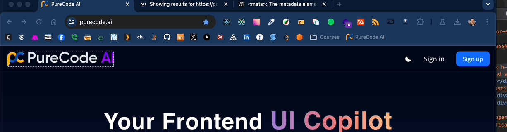
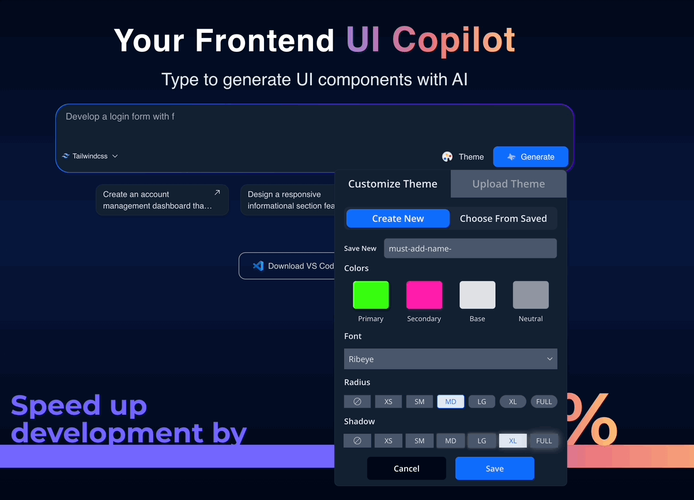
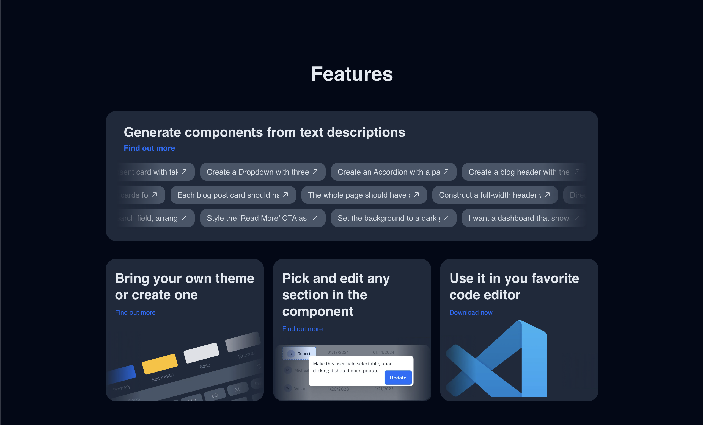
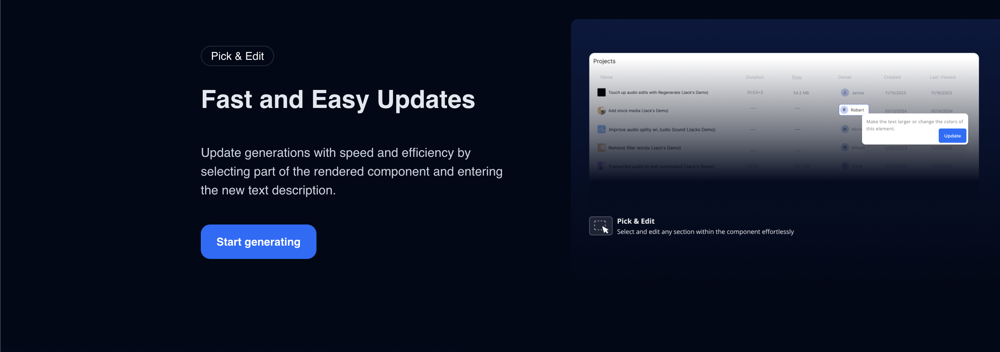
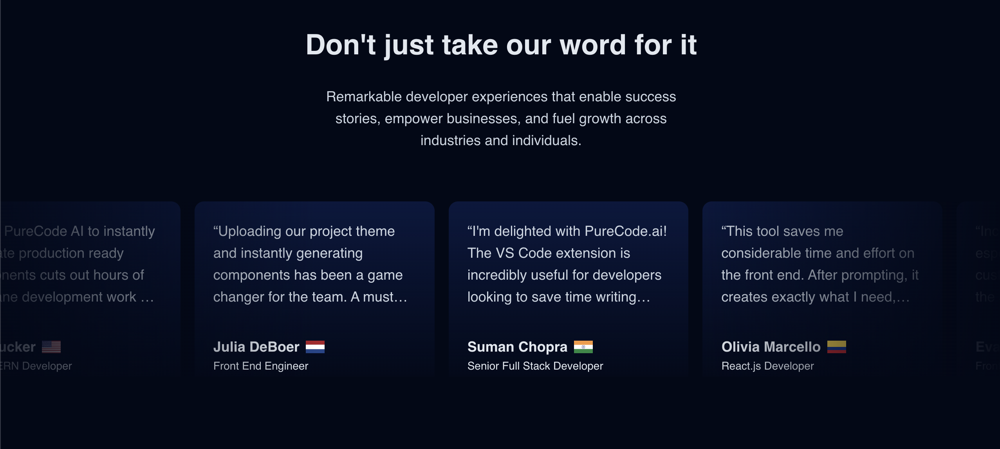
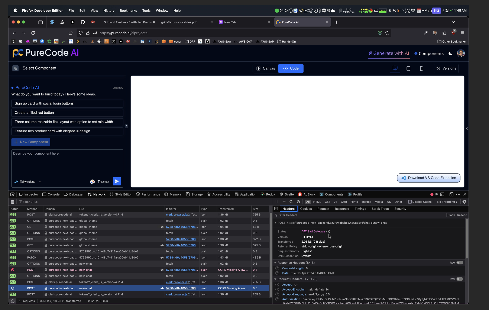
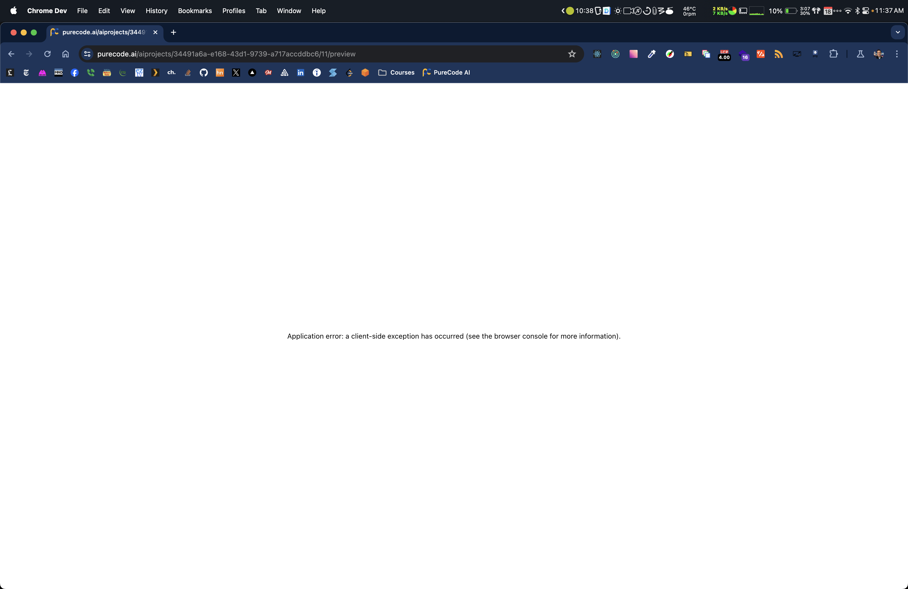

# PureCode.ai

# Table of Contents

- [PureCode.ai](#purecodeai)
- [Table of Contents](#table-of-contents)
- [Landing Page Thoughts](#landing-page-thoughts)
  - [`<head>` element](#head-element)
  - [`<body>` element](#body-element)
    - [Unauthenticated User](#unauthenticated-user)
      - [Desktop (1440px viewport - MacBook Air MX) - top to bottom page analysis](#desktop-1440px-viewport---macbook-air-mx---top-to-bottom-page-analysis)
        - [`<header>` element](#header-element)
        - [Call-To-Action](#call-to-action)
        - [Call-To-Action-Made-Up-Statistic (😅)](#call-to-action-made-up-statistic-)
        - [Features Card Section (General)](#features-card-section-general)
        - [Features Card Section (Detail)](#features-card-section-detail)
        - [Pre-Generated Components Example Grid](#pre-generated-components-example-grid)
        - [Testimonial Card "Carousel"](#testimonial-card-carousel)
        - [Pricing Comparison Chart](#pricing-comparison-chart)
        - [FAQ Section](#faq-section)
      - [Miscellaneous](#miscellaneous)
      - [Tablet (768px viewport - iPadMini)\[^1\]](#tablet-768px-viewport---ipadmini1)
      - [Mobile (430px viewport - iPhone 15 Pro Max)\[^1\]](#mobile-430px-viewport---iphone-15-pro-max1)
    - [Authenticated User](#authenticated-user)
      - [Desktop (1440px viewport - MacBook Air MX)\[^2\]](#desktop-1440px-viewport---macbook-air-mx2)
      - [Tablet (768px viewport - iPadMini)\[^1\]](#tablet-768px-viewport---ipadmini1-1)
      - [Mobile (430px viewport - iPhone 15 Pro Max)\[^1\]](#mobile-430px-viewport---iphone-15-pro-max1-1)
  - [General Positive Aspects of Landing Page (my bias - _strong opinions, weakly held_)](#general-positive-aspects-of-landing-page-my-bias---strong-opinions-weakly-held)
  - [Bugs/Possible Areas to Improve/General Critiques (my bias - _strong opinions, weakly held_)](#bugspossible-areas-to-improvegeneral-critiques-my-bias---strong-opinions-weakly-held)
- [Product Thoughts (web) - (very rough draft of my thoughts atm)](#product-thoughts-web---very-rough-draft-of-my-thoughts-atm)
  - [Product Feedback Video (10 minutes - apologizes for background noise)](#product-feedback-video-10-minutes---apologizes-for-background-noise)
- [Why I Would Be A Good Hire Video (6 minutes)](#why-i-would-be-a-good-hire-video-6-minutes)
- [VSCode Extension Thoughts](#vscode-extension-thoughts)

# Landing Page Thoughts

## `<head>` element

- `<link rel="preload" as="image" href="/img/project_table_section_dark.png">`
  - Suggest converting image to modern `.webp` format to align with other images on landing page and improve SEO score (included image conversion. see `images` directory; 20% size reduction vs `.png`, lossless conversion)

- `<meta name="description" content="A simple and powerful frontend AI copilot for the web.">`
  - Currently when I google "frontend ui component ai generator copilot" - the friendliest keywords I could mash together - `purecode.ai` shows up as the 28th link

- Suggest optimizing meta*description tag to include more keywords to move up SEO (e.g. \_A simple and powerful frontend UI component generator for the web powered by AI copilot.*)
- Related: Suggest including meta_keywords tag to include additional keywords. (e.g `<meta name="keywords" content="UI, component generator, AI copilot, frontend copilot">`)
- Suggest running site through [SEO optimizer](https://www.seoptimer.com/purecode.ai#recommendation)

- ``
  - Suggest offloading 3rd party analytics scripts off the main thread and on to service workers to increase [PageSpeed Score](https://pagespeed.web.dev/analysis/https-purecode-ai/sn6qlitvei?form_factor=desktop) (e.g. Hotjar) by implementing [Partytown package](https://partytown.builder.io/how-does-partytown-work)

- Run site through a [semantic HTML inspector](https://validator.w3.org/nu/?doc=https%3A%2F%2Fpurecode.ai%2F) (might be a lot of noise and not worth the effort - just including it to be thorough)

## `<body>` element

### Unauthenticated User

#### Desktop (1440px viewport - MacBook Air MX) - top to bottom page analysis

##### `<header>` element

- NitPicky: `Sign In` button is slow to render wrt to `Sign Up` button. I've only used Clerk once in a side-project, but I don't recall this being an inherent issue with the library.

- NitPicky: `Sign In` font-sze is noticeably larger (1rem vs 0.875rem) than `Sign Up` font - minor point but I can't seem to justify the inconsistency as a prudent style choice (most likely overlooked - again ... nit-picky)
  - I fixed the inconsistency below by changing `Sign In` font-size to 0.875rem

- NitPicky and EasyFix: The `Sign In` and `Sign Up` buttons would benefit from hover styles to enhance UX (see `vercel.com` gif below)

##### Call-To-Action

- StylisticBias 💃: If the user clicks `Generate` button without providing a prompt a feedback toast is presented to the user. Great! The toast is, however, some times difficult to notice because its background-color and the background-color of page is the same (toast border styling is the sole source of contrast here). There are multiple valid approaches to improve the UI here. One possible solution would be to add an emoji to the toast text in order to make it pop more and draw the user's eye towards it.

- Example of adding toast icon to enhance UX

- UX-Kudos 👍: I like the _prompt field focus styling_ that is applied when the user clicks on the `Generate` button without providing a prompt. Nice touch! 💋

- Bug 🐛: It's not possible to `Save` a custom theme if the user is not authenticated.
  - Solution: hide the `Theme` button until the user is authenticated or prompt the user to authenticated via ClerkAuth when user clicks `Save` theme button - similar to the UX experienced when a user clicks on an example prompt.
- Confusing UX 😕: It's not immediately apparent that the user needs to supply a value in the `name` field for the custom theme `Save` button to activate.
  - Suggest adding a tooltip that indicated the user must provide a name field when the custom theme `Save` button is hovered or on attempt to click disable button we could trigger another feedback toast.
  - More important is that this feature doesn't work for unauthenticated user's (which makes sense, but feels broken nonetheless - see Solution above)

- Bug 🐛 (or stylist-bias - very weakly held opinion here): When user clicks on a template prompt, they are prompted to authenticate via the Clerk modal. Great! However, if the user decides to navigate click the browser's back button the modal persist across page views which leads to a confusing UX (aside from [reddit](https://www.reddit.com/) - which isn't known for great ux - I can't find another site on the web that has a similar auth modal behavior on browser navigation). Most sites seem to prefer a full-page login/sign-page over a floating modal. I will admit this might not be a "bug", just a bit odd, but certainly low priority.
  - Expectation: I would expect the authentication modal to vanish upon `Back` browser navigation.

- Minor UX Quirk 🫠: The only way to dismiss the authentication modal is for the user to hit the escape key. It would be nice if there was an explicit close (X) button on the modal or if the modal vanished if the user clicked outside of the modal frame. See reddit authentication modal.

##### Call-To-Action-Made-Up-Statistic (😅)

- No constructive comment. Ship it! 🚚

##### Features Card Section (General)

- Only one comment (nit-picky). Why doesn't the wide-card (`Generate components from text descriptions`) animate and grow on hover and provide a `pointer: cursor` to indicate that the entire card is clickable? Seems inconsistent. In function, it's no different than the cards that link to detail feature card 02 through 04. I do notice that the `cursor: pointer` shows up when a user hover over the example prompt rows (nice little left-right animation of the prompts - fancy)

##### Features Card Section (Detail)

- No comment aside from a suggestion to add some subtle animation to the blue button on hover. Ship it! 🚚

##### Pre-Generated Components Example Grid

- Looks great. Ship it.

##### Testimonial Card "Carousel"

- No comment on desktop, but on smaller viewports it would be nice if the "carousel" was in fact functional (i.e. having the cards actually slide left-right when the user swipes across the carousel row)

##### Pricing Comparison Chart

- Ship it. Love it. Buttons have hover animations. ❤️

##### FAQ Section

- no comment

#### Miscellaneous

- Final comment: Where's a footer? Privacy Policy, Terms of Service, etc. Low priority I'm sure because the landing page is not the product. 👍

#### Tablet (768px viewport - iPadMini)[^1]

#### Mobile (430px viewport - iPhone 15 Pro Max)[^1]

### Authenticated User

#### Desktop (1440px viewport - MacBook Air MX)[^2]

- Comments to come in a few hours

#### Tablet (768px viewport - iPadMini)[^1]

#### Mobile (430px viewport - iPhone 15 Pro Max)[^1]

## General Positive Aspects of Landing Page (my bias - _strong opinions, weakly held_)

- Stay tuned! Quick words that pop into my head on first impression. Modern. Great dark color choices and use of gradients.
- 98% mobile responsive at first glance

## Bugs/Possible Areas to Improve/General Critiques (my bias - _strong opinions, weakly held_)

- More to come here soon.

# Product Thoughts (web) - (very rough draft of my thoughts atm)

- The meat and potatoes of PureCode.ai and where I first tried to give feedback, but when I started to poke around the web app I was unable to make use of its generative powers because the Azure backend was generating a `502 - Bad Gateway` error that rendered the app totally unusable.
- 
- The web app now works. I've played with it some. I'll post my feedback in a video walk along. Quick thoughts: Impressive, versioning of multi-step prompts has a lot of possibility to make this a very useful product. Web app, however, does seem a bit brittle and I find it necessary to operate always with DevTools open to obtain sufficient feedback on how the generative process is progressing. App-level crashes happen quite often, although typically a hard browser refresh enables one to continue building on previous prompt steps. At times, a new step with cause previously working functionality to vanish (ai forgetfulness is a thing)
- I wonder how long the web app has been in development?
- It's a shame that manually editing generated code is quite buggy at the moment (difficult with cursor placement and any attempts at editing generated code leads to garbled mess.)
- It currently feels like a developer-level of knowledge is need by a user to extract useful functionality from the app.
- It would be nice to add an appropriate React error boundary to limit effective crash area when the error below takes place (caused by an attempt to access undefined fields on render (`<ErrorBoundary/>` where are you?)). Hard-refresh usually allows for progress to be made.

## Product Feedback Video (10 minutes - apologizes for background noise)

[Download MP4 Video](./videos/MyCommentsOnWhyIWouldBeAGoodFirForTheFrontendDeveloperPosition.mp4)

# Why I Would Be A Good Hire Video (6 minutes)

[Download MP4 Video](./videos/WebAppVideoFeedback.mp4)

# VSCode Extension Thoughts

- I installed the VSCode extension, but it's currently not publicly functional: _"We are rolling out new feature in this extension"_
- Extension released on 23 March 2024. Last updated 16 April. Pre-Alpha stage.

---

[^1]: Thoughts not included for brevity (and given the use case for the site I suspect most users will be on a laptop) - I would be willing to explore in further detail if requested
[^2]: For sake of brevity, I will avoid any nit-picky stylist observations and only focus on bugs in the UI/UX - again I am willing to explore in more detail upon request
